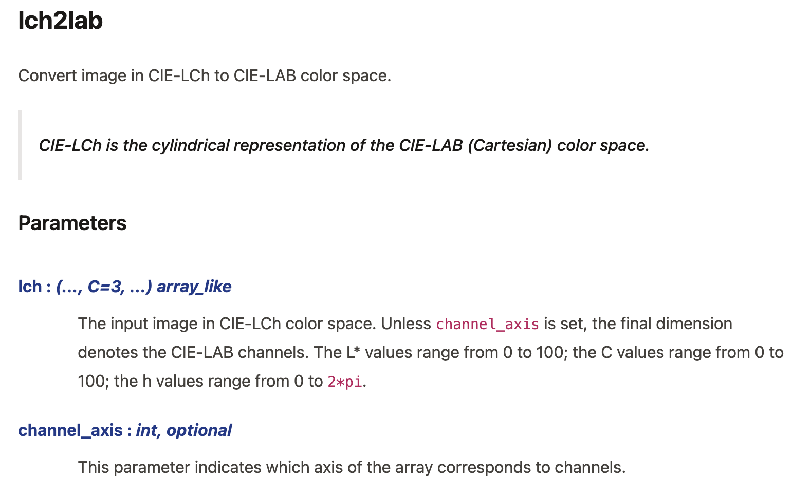

# myst-apidoc-plugin

MyST plugin for rendering API docs from `fleece` output.



## Development

To develop this package, you may run

```bash
npm install
npm run lint
```

Then, to add the plugin to your MyST build, you must build the `.mjs` file:

```bash
npm run build
```

Then link to the built file from you `myst.yml`:

```yaml
project:
  ...
  plugins:
    - myst-apidoc-plugin/dist/index.mjs
```

## Extracting docstring data

```sh
fleece skimage > skimage-api.json
```

## Plugin Usage

In your markdown you may now reference the generator JSON output to render the full documentation:

```md
:::{apidoc} ./skimage-api.json
:::
```

You can specify the module name and heading depth as options:

```md
:::{apidoc} ./skimage-api.json
:module: skimage
:depth: 2
:::
```

You can also target a specific submodule:

```md
:::{apidoc} ./skimage-api.json#color
:module: skimage
:depth: 2
:::
```

or a specific function:

```md
:::{apidoc} ./skimage-api.json#color.lch2lab
:module: skimage
:depth: 2
:::
```
